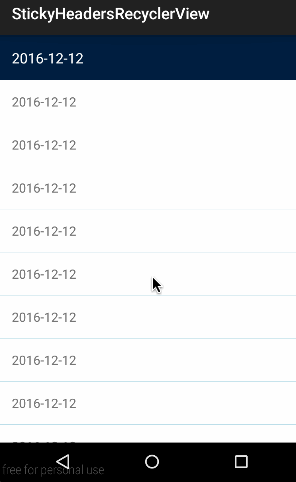

# StickyHeadersRecyclerView
 
## shows
 
## apk
[sample.apk](https://github.com/Sing1/StickyHeadersRecyclerView/blob/master/app/app.apk)

## gradle:
```groovy
dependencies {
    ...
    compile 'sing.stickyrecyclerview:library:1.0.1'
}
```
## Maven:
```xml
<dependency>
　　<groupId>sing.stickyrecyclerview</groupId>
　　<artifactId>library</artifactId>
　　<version>1.0.1</version>
　　<type>pom</type>
</dependency>
```
## Simple:
#### Bean
```JAVA
public class MainBean implements Serializable {

    public String time;
    public String description;
    
    public MainBean(String time, String description) {
        this.time = time;
        this.description = description;
    }
}
```
#### Activity
```JAVA 
public class MainActivity extends AppCompatActivity {

    private RecyclerView recyclerView;
    private MyAdapter adapter;

    @Override
    protected void onCreate(Bundle savedInstanceState) {
        super.onCreate(savedInstanceState);
        setContentView(R.layout.activity_main);

        recyclerView = (RecyclerView) findViewById(R.id.recyclerview);

        adapter = new MyAdapter(getList());
        recyclerView.setAdapter(adapter);

        // Set layout manager
        final LinearLayoutManager layoutManager = new LinearLayoutManager(this, LinearLayoutManager.VERTICAL, false);
        recyclerView.setLayoutManager(layoutManager);

        // Add the sticky headers decoration
        final StickyRecyclerHeadersDecoration headersDecor = new StickyRecyclerHeadersDecoration(adapter);
        recyclerView.addItemDecoration(headersDecor);

        // Add decoration for dividers between list items
        recyclerView.addItemDecoration(new DividerDecoration(this));

        // Add touch listeners
        StickyRecyclerHeadersTouchListener touchListener = new StickyRecyclerHeadersTouchListener(recyclerView, headersDecor);
        touchListener.setOnHeaderClickListener(new StickyRecyclerHeadersTouchListener.OnHeaderClickListener() {
            @Override
            public void onHeaderClick(View header, int position, long headerId) {
                Toast.makeText(MainActivity.this, "Header position: " + position + ", id: " + headerId, Toast.LENGTH_SHORT).show();
            }
        });
        recyclerView.addOnItemTouchListener(touchListener);
        recyclerView.addOnItemTouchListener(new RecyclerItemClickListener(this, new RecyclerItemClickListener.OnItemClickListener() {
            @Override
            public void onItemClick(View view, int position) {
                Toast.makeText(MainActivity.this, getList().get(position).description, Toast.LENGTH_SHORT).show();
            }
        }));
        adapter.registerAdapterDataObserver(new RecyclerView.AdapterDataObserver() {
            @Override
            public void onChanged() {
                headersDecor.invalidateHeaders();
            }
        });
    }
}
```
#### Adapter
```JAVA
public class MyAdapter extends RecyclerView.Adapter<RecyclerView.ViewHolder>
        implements StickyRecyclerHeadersAdapter<RecyclerView.ViewHolder> {

    private List<MainBean> list = new ArrayList<>();

    public MyAdapter(List<MainBean> list) {
        this.list = list;
        setHasStableIds(true);
    }

    @Override
    public long getItemId(int position) {
        return list.get(position).hashCode();
    }

    @Override
    public int getItemCount() {
        return list.size();
    }

    @Override
    public RecyclerView.ViewHolder onCreateViewHolder(ViewGroup parent, int viewType) {
        View view = LayoutInflater.from(parent.getContext()).inflate(R.layout.view_item, parent, false);
        return new RecyclerView.ViewHolder(view) {};
    }

    @Override
    public void onBindViewHolder(RecyclerView.ViewHolder holder, int position) {
        TextView textView = (TextView) holder.itemView;//布局最外层是TextView
        textView.setText(list.get(position).description);
    }

    @Override
    public long getHeaderId(int position) {
        return list.get(position).time.charAt(9);
    }

    @Override
    public RecyclerView.ViewHolder onCreateHeaderViewHolder(ViewGroup parent) {
        View view = LayoutInflater.from(parent.getContext()).inflate(R.layout.view_header, parent, false);
        return new RecyclerView.ViewHolder(view) {};
    }

    @Override
    public void onBindHeaderViewHolder(RecyclerView.ViewHolder holder, int position) {
        TextView textView = (TextView) holder.itemView;
        textView.setText(list.get(position).time);
    }
}
```